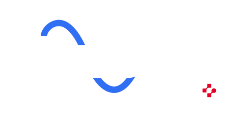
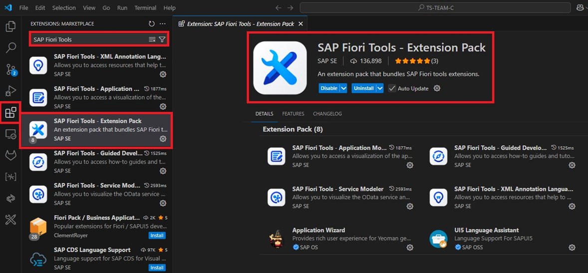
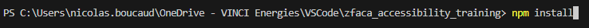
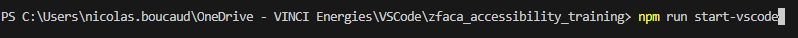
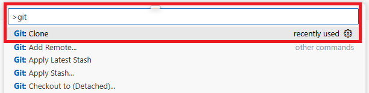
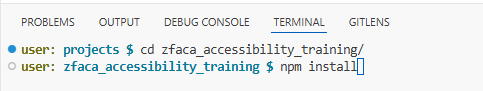
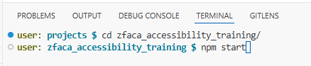

<p align="center">
  
</p>

# SAPUI5 Accessibility in Action: Building Inclusive Fiori Apps

## ZFACA_ACCESSIBILITY

This project can be launched in **two different ways**, depending on your working environment:

---

## 🚀 Option 1. Run with GitHub Codespaces (**Recommended**)

Codespaces allows you to start coding immediately without any local setup.

### 🔧 Steps

1. **Create your own repository**

👉 [Create from template](https://github.com/devops-vesi/zfaca_accessibility_training/generate)

- Name your repo: `ui5con-accessibility-workshop-yourname`
- Leave all checkboxes **unchecked**
- Click **“Create repository from template”**

2. **Open in Codespaces**

- Open your newly created repository
- Click **Code > Open with Codespaces > Create new Codespace**

✅ You will be ready to code in seconds — **no local installation required**.

---

## 💻 Option 2. Run on a traditional development environment (VSCode or BAS)

You can also clone the project and run it from **Visual Studio Code** or **Business Application Studio (BAS)**.

---

### 🖥️ **A. Visual Studio Code**

#### ⚙️ Prerequisites

1. Download and Install [Git](https://git-scm.com/downloads)  
2. Download and Install the latest (LTS) version of [NodeJS](https://nodejs.org/en/download)  
3. Download and Install [Visual Studio Code](https://code.visualstudio.com/Download)  
4. Install **SAP Fiori Tools – Extension Pack** from the VSCode marketplace.

    

#### 📥 Clone and configure

5. Open VSCode console then configure Git by typing:
    ```
    git config --global user.name "LASTNAME Firstname"
    git config --global user.email "xxxx@xxxxxx.com"
    git config --global http.sslVerify false
    ```

6. Clone the repository:
    - Open VSCode
    - In the command palette, type:
        ```
        git clone https://github.com/devops-vesi/zfaca_accessibility_training.git
        ```

7. Open a terminal in the project folder and install dependencies:
    ```
    npm install
    ```
    

#### ▶️ Launch the app

In VSCode terminal:
```
npm run start-vscode
```


---

### ☁️ **B. Business Application Studio (BAS)**

#### 📥 Clone and configure

1. Open BAS and a new terminal.

2. Configure Git:
    ```
    git config --global user.name "LASTNAME Firstname"
    git config --global user.email "xxxx@vinci-energies.com"
    ```

3. Clone the repository:
    - In the BAS command palette, type:
        ```
        >Git: Clone
        ```
        

    - Paste the repository URL:
        ```
        https://github.com/devops-vesi/zfaca_accessibility_training.git
        ```

4. Open the terminal (Terminal -> New Terminal)  
   Make sure you are in the project folder.

5. Install packages:
    ```
    npm install
    ```
    

#### ▶️ Launch the app

In BAS terminal:
```
npm start
```


---

✅ **Summary**

- **Codespaces:** Instant setup, recommended for the workshop.  
- **VSCode or BAS:** Requires installation and setup. Choose this option if you prefer using a traditional development environment.

---

For any issue or clarification, please contact the workshop organizers.

---

## 📝 Exercises

Below are the practical exercises for this workshop.

1. [Role](./exercise-instructions/role.md)
2. [Accessible Name](./exercise-instructions/accessible_name.md)
3. [Error Management & Context Changes](./exercise-instructions/error_management_context_changes.md)
4. [Keyboard Navigation](./exercise-instructions/keyboard_navigation.md)
5. [Other Best Practices](./exercise-instructions/other_best_practices.md)

➡️ **Please follow each exercise in order** to reinforce your learning and apply the accessibility fundamentals in practice.

---

