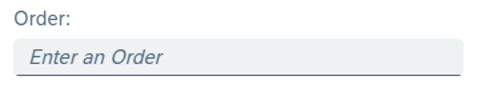
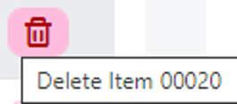
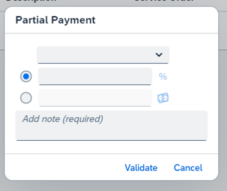
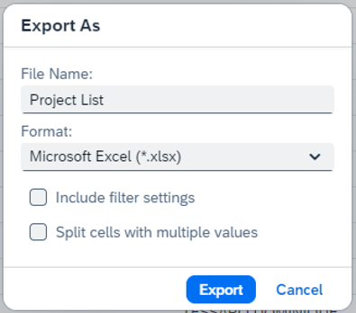

# 📝 Exercise – Accessible Name

## 📚 Introduction

An accessible name is a short string, typically 1 to 3 words, associated with an element to provide users of assistive technologies with a label for the element.

---

## 🎯 Purpose

An accessible name serves two primary purposes for users of assistive technologies, such as screen readers:

- **Convey the purpose or intent** of the element.
- **Distinguish the element** from other elements on the page.

🔗 **Resources:**
- [Mozilla Accessible Name](https://developer.mozilla.org/en-US/docs/Web/Accessibility/ARIA/Attributes/aria-label)
- [WAI Accessible Name](https://www.w3.org/WAI/WCAG21/Techniques/general/G208)

---

## 🖼️ Static Visual Content

### 🔹 Decorative Visual Elements

- If visual content is purely **decorative**, it should be **ignored** by assistive technologies.
- SAP provides a `decorative` property to ignore visual content like the image path if the alt is missing or unnecessary information.

---

### 🔹 Informative Visual Elements

- The **information** provided by the image must be available to everyone. This is done through **alternative text**.

---

## 🔧 Interactive Elements

### 🔹 Text Interactive Components

- For a text button, the **accessible name** is implicit.
- For a field, the **accessible name** is also the **label** rather than the placeholder, which is input guidance.

---

### 🔹 Icon Only Interactive Components

- For an **icon only button**, the accessible name is provided by the tooltip: `[aria-label] + [title]`.

---

## 🖼️ Accessible Name Examples

### 🔹 Critical Case

SAPUI5 Application dialog 1: **no labels**

---

### 🔹 Good Example

SAPUI5 Application dialog 1: **well rendered and relevant labels**

---

## 📊 Accessible Name – Exercises

### 🎯 Objectives

Learn how to manage **Accessible Names** in different situations:

- With Input Controls
- With Images
- With Tables
- With Buttons and Tabs
- With Dialogs

---

### 📝 Instructions
- Carry out the exercises **from #4 to #12**
- Use a **screen reader** to validate your work

| # | Exercise | Objective |
|---|----------|-----------|
| 4 | Providing Labels for Input Controls | Learn how to link labels and input fields properly using the **labelFor property** to improve accessibility, particularly for screen readers. |
| 5 | Using Invisible Text for grouped Input Controls | Learn how to enhance accessibility by adding labels to give extra context for a grouped input field using **Invisible Text** and **ariaLabelledBy**. |
| 6 | Input description managed by ariaDescribedBy | Learn how to enhance accessibility by providing extra context for an input field using **ariaDescribedBy** or the **Description property**. |
| 7 | Providing Titles for Tables | Learn how to enhance accessibility by providing extra context for a table title using **ariaLabelledBy**. |
| 8 | Providing Text Alternative for Images and Icons | Learn how to enhance accessibility by providing meaningful **text alternatives** (alt text) for images and icons. |
| 9 | Providing Tooltips for Icon-Only Buttons | Learn how to improve accessibility for icon-only buttons by adding **tooltips**. |
| 10 | Providing Tooltips for Segmented Button | Learn how to improve accessibility by providing a meaningful label to a segmented button using **Invisible Text** and **ariaLabelledBy**. |
| 11 | Providing Tooltips for Icon Tabs | Learn how to improve accessibility by providing **tooltips** for Icon Tabs that lack context. |
| 12 | Providing Labels for Popups | Learn how to make popups (like **Dialogs**) more accessible by ensuring each dialog has a proper label using **ariaLabelledBy**. |

---
