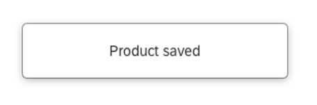

# 📝 Exercise – #3 Error Management & Context Changes

## 📚 Introduction

The intent is to ensure:

- Users are aware that an **error has occurred** and can determine what is wrong.
- Users receive **appropriate suggestions** for correction of an input error if possible.
- Users avoid **serious consequences** as the result of a mistake when performing an action that cannot be reversed.

---

## 🎯 Purpose

Providing information about input errors in text allows users to:

- Perceive that an **error occurred**.
- Understand how to **correct input errors** to fill in forms successfully, reducing the number of times they need to change input values.
- Be protected from **serious consequences** resulting from mistakes, especially users with disabilities who may be more likely to make mistakes.

🔗 **Resources:**
- [Error Identification](https://www.w3.org/WAI/WCAG21/Techniques/general/G83)
- [Error Suggestion](https://www.w3.org/WAI/WCAG21/Techniques/general/G84)
- [Error Prevention](https://www.w3.org/WAI/WCAG21/Techniques/general/G98)

---

## 📝 Forms Best Practices

### 🔹 Associate Label and Field

- Labels must be **associated to the field** to provide an accessible name to screen readers.
- **Placeholder** is an input hint, not an accessible name.

---

### 🔹 Grouping Fields

- **Group fields** when they answer the same question.
- Add a **legend** and bind it to the group.

---

## 💡 Provide Input Assistance

- Ensure the **input control is accessible**.
- Provide **sample data formats** where necessary in labels and error messages.

---

## 💬 Provide Feedback

- Provide **feedback visually** and for screen readers.
- Give **enough time to read**.

---

## 📝 Forms Examples

### 🔴 Critical Case

**Issue:** Equipment Reservation Follow-up – no labels and truncated placeholders at 175% zoom.

---

### 🟢 Good Example

**Solution:** Visible labels and explicit error control.

## 📚 Context Changes – Introduction

Major changes that, if made without user awareness, can disorient users who are not able to view the entire page simultaneously.

Changes in context include changes of:

- **user agent**
- **viewport**
- **focus**
- **content** that changes the meaning of the Web page

---

### 💡 Example

Opening a new window, moving focus to a different component, going to a new page (including anything that would look to a user as if they had moved to a new page) or significantly re-arranging the content of a page are examples of changes of context.

🔗 **Resources:**
- [On focus](https://www.w3.org/WAI/WCAG21/Understanding/on-focus.html)
- [On input](https://www.w3.org/WAI/WCAG21/Understanding/on-input.html)
- [Change on Request](https://www.w3.org/WAI/WCAG21/Understanding/change-on-request.html)
- [Help](https://www.w3.org/WAI/WCAG21/Understanding/help.html)

---

### 📝 Give a feedback when a large section of the page is updated
Use an invisible text or a toast message to notify screen reader users.

---

## 📊 Error Management & Context Changes – Exercises

### 🎯 Objectives

Learn to how to manage **Errors and Context changes** in forms using:

- Field Validation
- Message Strip
- Invisible Message

---

### 📝 Instructions
- Carry out the exercises **from #13 to #15**
- Use the screen reader to validate your work.

### ⚠️ Error Management Exercises
| # | Exercise | Objective |
|---|----------|-----------|
| 13 | Field Validation | **Error Management**: Learn how to manage **field validation** for required (mandatory) input fields. |
| 14 | Message Strip | **Error Management**: Learn how to use the **message strip** to give accessible 💬 feedback in a form. |

---

### 🗂️ Context Changes Exercises

| # | Exercise | Objective |
|---|----------|-----------|
| 15 | Invisible Messaging | **Context Changes**: Learn how to use **Invisible Messaging** to provide non-visual 💬 feedback for users relying on screen readers. |

---

[Go to next part (#4 Keyboard Navigation)](keyboard_navigation.md)