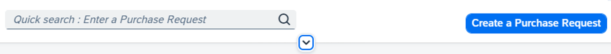
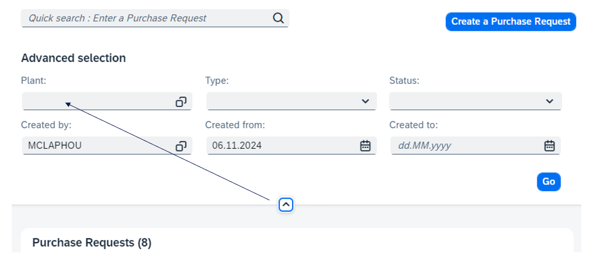

# 📝 Exercise - #4 Keyboard Navigation

## 📚 Introduction

All functionality of the content is operable through a keyboard interface **without requiring specific timings for individual keystrokes**, except where the underlying function requires input that depends on the path of the user's movement and not just the endpoints.

---

## 🎯 Purpose

If all functionality can be achieved **using the keyboard**, it can be accomplished by keyboard users, by **speech input** (which creates keyboard input), by **mouse** (using on-screen keyboards), and by a **wide variety of assistive technologies** that create simulated keystrokes as their output.

🔗 **Resources:**
- [Keyboard](https://www.w3.org/WAI/WCAG21/Understanding/keyboard.html)
- [No Keyboard Trap](https://www.w3.org/WAI/WCAG21/Understanding/no-keyboard-trap.html)

---

## 💡 Focus Handling Example

Help keyboard users to navigate when the order changes:

**Case 1:**

- The collapse header arrow button adds filters before the content.
- **Screen reader users are not informed** of the content added above.

**Case 2:**

Move the focus to the first filter when you activate the filter bar.

---

## 📝 Keyboard Navigation - Exercises

### 🎯 Objectives

Learn how to manage:

- **Custom Shortcut** (Command Execution)
- **Focus**

---

### 📋 Instructions

- Carry out the exercises **#16 & #17**
- Use the **keyboard and screen reader** to validate your work

| # | Exercise | Objective |
|---|----------|-----------|
| 16 | Use Command Execution | Learn how to assign **keyboard commands** to UI components, allowing for faster and more accessible interaction using keyboard shortcuts. |
| 17 | Set up focus handling | Learn how to **handle focus**. |

---

[Go to next part: #5 Other Best Practice](other_best_practices.md)