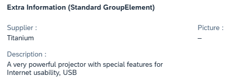
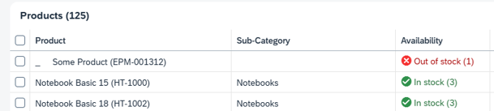

## 📝 Exercise - #5 Other Best Practices

### 📚 Introduction

In some cases, the values displayed are empty. It is necessary to ensure that this is restored to the screen reader.

---

### 💡 Blank / Empty Values

Examples:

#### 🗂️ In a Form (text)

#### 🗂️ In a Table

---
## 📝 Other Best Practices - Exercises
### 🎯 Objectives

Learn how to manage:

- Empty values in content
- Empty values in tables

---

### 📋 Instructions

- Carry out the exercise **#18**.
- Use the screen reader to validate your work.

| #  | Exercise             | Objective                                                    |
|----|----------------------|--------------------------------------------------------------|
| 18 | Blank / Empty Values | Learn how to manage empty values in content and tables. |

---
🎉 **Congratulations on reaching the end of the workshop!**  
If you'd like to revisit or test all exercises, here are the access passwords:

  
🔐 Access Passwords for Exercises

Each exercise is protected by a password. Use the corresponding one below to unlock the content in the application.

| #  | Exercise Title                                                 | Password  |
|----|----------------------------------------------------------------|-----------|
| 01 | Modify Link role into a Button role                            | `vanish`  |
| 02 | Define ariaHasPopup                                            | `mosquito`|
| 03 | Define Landmarks                                               | `pride`   |
| 04 | Providing Labels for Input Controls                            | `trigger` |
| 05 | Using Invisible Text for grouped Input Controls                | `race`    |
| 06 | Input description managed by ariaDescribedBy                   | `cruise`  |
| 07 | Providing Titles for Tables                                    | `island`  |
| 08 | Providing Text Alternative for Images and Icons                | `photo`   |
| 09 | Providing Tooltips for Icon-Only Buttons                       | `need`    |
| 10 | Providing Tooltips for Segmented Button                        | `lawsuit` |
| 11 | Providing Tooltips for Icon Tabs                               | `sign`    |
| 12 | Providing Labels for Popups                                    | `horror`  |
| 13 | Field Validation                                               | `grab`    |
| 14 | Message Strip                                                  | `north`   |
| 15 | Invisible Messaging                                            | `promote` |
| 16 | Use Command Execution                                          | `surge`   |
| 17 | Set up focus handling                                          | `shrimp`  |
| 18 | Blank / Empty Values                                           | `cannon`  |

