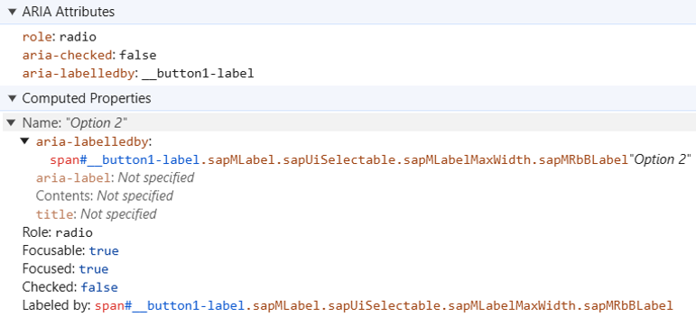

# 📝 Exercise - #1 Role

## 📚 Introduction

Roles provide **semantic meaning** to content, allowing screen readers and other tools to present and support interaction with an object in a way that is consistent with user expectations of that type of object.

---

## 🔧 Usage

ARIA roles can be used to describe elements that don't natively exist in HTML or exist but don't yet have full browser support.

By default, many semantic elements in HTML have a role, for example:

```html
<input type="radio"> <!-- has the "radio" role -->
```

Non-semantic elements in HTML do not have a role;  
`<div>` and `<span>` without added semantics return null. The **role attribute provides semantics** to them.

---

## 📂 Categories of ARIA Roles

- **Document structure roles**: e.g. Toolbar, Tooltip, Presentation/None, Feed
- **Widget roles**: e.g. Searchbox, Slider, Spinbutton, Switch, Tab, Combobox, Menu
- **Landmark roles**: e.g. Banner, Contentinfo, Main, Navigation, Region, Search
- **Live region roles**: e.g. Alert, Status, Timer
- **Window roles**: e.g. Alertdialog, Dialog

🔗 **Resources:**
- [Mozilla ARIA Roles](https://developer.mozilla.org/en-US/docs/Web/Accessibility/ARIA/Roles)
- [WAI ARIA Roles](https://www.w3.org/WAI/ARIA/apg/practices/)

---

## 🖼️ Landmark Roles Examples


---

## 📖 UI5 API Documentation

You can find the list of the roles used by UI5 in:

- [AccessibleRole](https://sapui5.hana.ondemand.com/1.108.39/#/api/sap.ui.core.AccessibleRole%23properties)
- [AccessibleLandmarkRole](https://sapui5.hana.ondemand.com/1.108.39/#/api/sap.ui.core.AccessibleLandmarkRole)

---

## 🔬 Comparison of Generated HTML

Below is a **comparison of radio button implementations** in AngularJS vs UI5:

### 🔹 Radio Button in AngularJS

```html
<input _ngcontent-xxa-c185 id="typePresence_2" type="radio" name="typePresenceRadio" class="ng-untouched ng-pristine ng-valid">
```


Generates an:

```html
<input type="radio">
```

---

### 🔹 Radio Button in UI5

```html
<div id="__button1" data-sap-ui="__button1" role="radio" aria-checked="false" aria-labelledby="__button1-label" tabindex="-1" class="sapMRb sapMRbHasLabel"> flex
</div>
```



Generates a:

```html
<div role="radio"></div>
```

---

## 📝 Role - Exercises

### 🎯 Objectives

Learn to manipulate **Roles**:

- Change a Link role into a Button role
- Add more information to the role of buttons that open dialogs
- Define Landmark Roles to structure a page

---

### 📋 Instructions
- If you haven’t done so already, launch the application
- Carry out the exercises **from #1 to #3** (You need to go back to the tab displaying the application: the instructions are shown directly there)
- Use the screen reader to validate your work: You have to use keyboard navigation (positionate with arrow keys x Tab)
- Whenever you are stuck, you can get help by clicking on:

- A password to access the complete solution will be provided by the instructors at some point
- For Landmark Roles you can also use these extensions:
  - [Landmark Navigation via Keyboard](https://chromewebstore.google.com/detail/landmark-navigation-via-k/ddpokpbjopmeeiiolheejjpkonlkklgp)
  - [Web Developer](https://chromewebstore.google.com/detail/web-developer/bfbameneiokkgbdmiekhjnmfkcnldhhm)

| # | Exercise | Objective |
|---|----------|-----------|
| 1 | Modify Link role into a Button role | Learn how to change Link Role into **Button Role** |
| 2 | Define `ariaHasPopup` | Learn the importance of assigning the **ariaHasPopup** property to buttons that trigger popups, menus, or lists. |
| 3 | Define Landmarks | Learn how to use **Landmarks** to identify the different sections of a web page clearly and make it easier to navigate using assistive technologies. |

---

[Go to next part: #2 Accessible Name](accessible_name.md)
