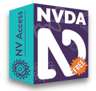
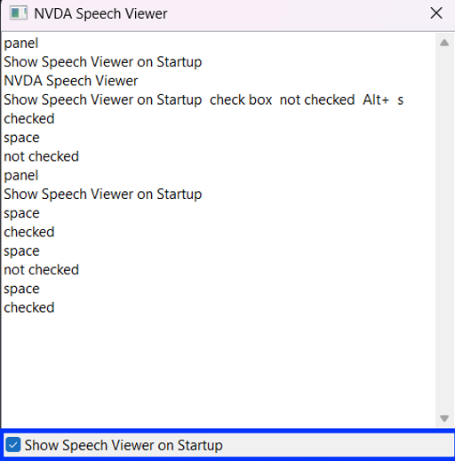

# 📝 NVDA Configuration & Shortcuts (Windows Only)

## ⚙️ Preliminary – Install NVDA

Before configuring NVDA, ensure it is installed on your device.

🔗 **Download NVDA:** [https://www.nvaccess.org/download/](https://www.nvaccess.org/download/)

✅ **Installation steps:**

1. Download the setup file (e.g. `nvda_2025.1.2.exe`).
2. Run the downloaded file. Music plays while a temporary copy of NVDA loads. NVDA will speak throughout the process.
3. The NVDA Launcher window appears with the license agreement. Press **Down Arrow** to read it.
4. Press **Tab** to move to the “I agree” checkbox, then press **Spacebar** to check it.
5. Press **Tab** to move through options, then press **Enter** on the desired option.
6. If you do not have admin rights: select **“Create portable copy”**.  
   This allows NVDA to be set up in any folder without installing, useful on computers without admin rights or on a memory stick to carry with you. NVDA will guide you through creating the portable copy – the main input is the destination folder.

---

## 🛠️ NVDA Configuration Steps

### 🔧 1. Set NVDA Modifier Key for Shortcut Activation

NVDA uses a special modifier key (the NVDA key) for its shortcuts (e.g., NVDA + T to read a window title).

✅ **How to set it:**

1. Right-click the NVDA icon in the system tray  
2. Go to **Preferences → Settings...**  
3. In the left panel, click **Keyboard**  
4. Under **Keyboard layout**, select **Laptop**  
5. Under **Select NVDA Modifier Keys**, check **Caps Lock**  
   - (Recommended for laptop users; uncheck others if desired)
   
6. Click **Apply** and **OK**

This enables **Caps Lock + [key]** as your NVDA shortcut combo.

---

### 🔧 2. Enable Visual Highlight for Focus Tracking

This setting highlights elements NVDA is focusing on – useful for debugging and demos.

✅ **How to enable it:**

1. Right-click the NVDA icon → **Preferences → Settings...**

2. In the left panel, select **Vision**  
3. Check **Enable Highlighting** and the three options:  
   - Highlight system focus  
   - Highlight navigator object  
   - Highlight browse mode cursor  

4. Click **Apply** and **OK**

---

### 🔧 3. Set NVDA Interface Language

This setting changes the language of NVDA’s interface and messages, including menus, dialogs, and screen reader feedback. It’s important to set the correct language to ensure consistency with the language of the application being tested (e.g., SAP Fiori in French).

✅ **How to configure it:**

1. Right-click NVDA icon → **Preferences → Settings...**  
2. Click **General** in the left panel  
3. At **NVDA Language**, select your preferred language (e.g. English)

4. Click **Apply** then restart NVDA

---

### 🔧 4. Enable Windows OCR

This allows NVDA to read text in images or inaccessible elements.

✅ **How to configure it:**

1. Right-click NVDA icon → **Preferences → Settings...**  
2. Select **Windows OCR** in the left panel  
3. Choose your recognition language

4. Click **Apply** and **OK**

You can now use **NVDA key + R** to trigger OCR.

---

### 🔧 5. Enable Speech Viewer

Displays NVDA announcements in a floating window. It’s especially useful during development and testing, when audio feedback alone is not sufficient or practical (e.g., in a noisy environment or when demonstrating accessibility behavior).

✅ **How to enable it:**

1. Right-click NVDA icon → **Tools → Speech Viewer**

A new window will open, displaying all spoken feedback in real time. In the context of this hands-on, to make testing easier, check “Show Speech Viewer on Startup:

---

## 📑 NVDA Shortcut Sheet

### 🔑 Basic NVDA Control Shortcuts

| Shortcut | Action |
|----------|--------|
| Ctrl + Alt + N | Start NVDA |
| Caps Lock + Q | Quit NVDA |
| Caps Lock + S | Toggle speech mode (Speak / Beep / Off) |

💡 **Note:** Caps Lock is used as the NVDA modifier key when using the Laptop keyboard layout.

---

### 🧭 Navigation Inside Fiori Apps
These shortcuts help testers move through headings, regions, form fields, and buttons that are all critical in SAP Fiori accessibility validation.
#### 🔹 Landmarks and Headings

| Shortcut | Action |
|----------|--------|
| D | Next landmark |
| Shift + D | Previous landmark |
| H | Next heading |
| Shift + H | Previous heading |
| 1–6 | Next heading level 1 to 6 |
| Shift + 1–6 | Previous heading level 1 to 6 |

---

#### 🔹 Form Elements & Controls

| Shortcut | Action |
|----------|--------|
| F | Next form field |
| Shift + F | Previous form field |
| B | Next button |
| Shift + B | Previous button |
| X | Next checkbox |
| E | Next text field (edit field) |
| C | Next combo box |
| R | Next radio button |

---

#### 🔹 Lists, Tables, and Structures

| Shortcut | Action |
|----------|--------|
| T | Next table |
| Ctrl + Alt + Arrow Keys | Navigate within table cells |
| L | Next list |
| I | Next list item |

---

#### 🔹 General Navigation and Reading

| Shortcut | Action |
|----------|--------|
| Tab / Shift + Tab | Move forward/backward between active elements |
| NVDA + Tab | Speak current focus with context |
| NVDA + Up Arrow | Repeat last spoken item |
| NVDA + Down Arrow | Read next line |

---

➡️ *Ensure your NVDA is configured before starting accessibility exercises for optimal testing.*

---

# 🍏 VoiceOver Configuration (macOS)

## ⚙️ Preliminary – Enable VoiceOver

VoiceOver is built into macOS and doesn't require any installation.

✅ **To activate VoiceOver:**

- Press **Cmd + F5**  
  *(or Cmd + Fn + F5 on some Mac keyboards)*

💬 You will hear VoiceOver say “VoiceOver On” and it will begin reading screen content aloud.

---

## 🛠️ VoiceOver Preferences

> ⚠️ **Note:** VoiceOver support and behavior can vary across macOS versions and web technologies. This section is a work in progress and may require additional testing and refinement, especially for complex SAP Fiori components.

To customize VoiceOver behavior:

1. Open **System Settings** → **Accessibility**  
2. Click on **VoiceOver**  
3. Press **Open VoiceOver Utility**

Here you can configure:

- **Verbosity** (what and how much is spoken)
- **Navigation** behavior
- **Speech and voice** settings
- **Braille**, **Sound**, and more

---

## 🔑 Common VoiceOver Shortcuts (Quick Sheet)

> VoiceOver uses a modifier key called **Control + Option**, abbreviated as `VO`.

| Shortcut | Action |
|----------|--------|
| `Cmd + F5` | Toggle VoiceOver |
| `VO + Arrow Keys` | Navigate interface |

💡 You can customize the **VoiceOver modifier** to just `Caps Lock`

---

[Go back to README - Exercises Summary](README.md#-exercises)

OR

[Continue and start directly with Exercise #1](./exercise-instructions/role.md)