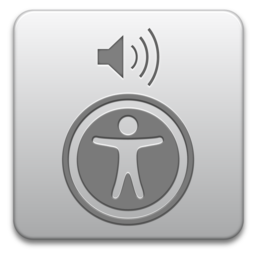

# 🍏 VoiceOver Configuration (macOS)

## ⚙️ Preliminary – Enable VoiceOver

VoiceOver is built into macOS and doesn't require any installation.

✅ **To activate VoiceOver:**

- Press **Cmd + F5**  
  *(or Cmd + Fn + F5 on some Mac keyboards)*

💬 You will hear VoiceOver say “VoiceOver On” and it will begin reading screen content aloud.

---

## 🛠️ VoiceOver Preferences

> ⚠️ **Note:** VoiceOver support and behavior can vary across macOS versions and web technologies. This section is a work in progress and may require additional testing and refinement, especially for complex SAP Fiori components.

To customize VoiceOver behavior:

1. Open **System Settings** → **Accessibility**  
2. Click on **VoiceOver**  
3. Press **Open VoiceOver Utility**

Here you can configure:

- **Verbosity** (what and how much is spoken)
- **Navigation** behavior
- **Speech and voice** settings
- **Braille**, **Sound**, and more

---

## 🔑 Common VoiceOver Shortcuts (Quick Sheet)

> VoiceOver uses a modifier key called **Control + Option**, abbreviated as `VO`.

| Shortcut | Action |
|----------|--------|
| `Cmd + F5` | Toggle VoiceOver |
| `VO + Arrow Keys` | Navigate interface |

💡 You can customize the **VoiceOver modifier** to just `Caps Lock`

---

[Go back to README - Exercises Summary](README.md#-exercises)

OR

[Continue and start directly with Exercise #1](./exercise-instructions/role.md)